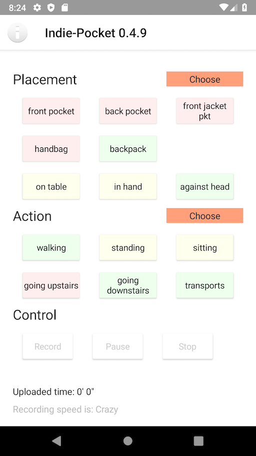
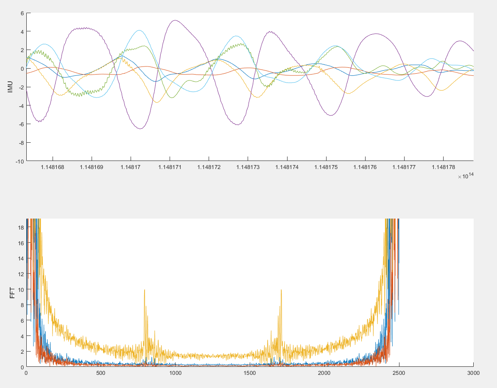

# Indie-Pocket

Here is a longer documentation with more details: 
[IndiePocket-Documentation](https://htmlpreview.github.io/?https://github.com/indie-pocket/indie-pocket/blob/master/doc/Indie%20Pocket.html)

## Inspiration
Proposal suggested by James Larus from (the PEPP-PT https://www.pepp-pt.org/): 

"Here’s a real problem for which we need some good solutions. 
    As part of our privacy-preserving proximity tracking work (https://github.com/DP-3T), we 
    are going to use Bluetooth to measure distance between peoples’ phones. 
    One big concern is that people put their phones in different places 
    (front pocket, back pocket, shirt pocket, bag, etc.). 
    Can we use the accelerometer and pressure sensor (altitude) to infer where a phone is located on a person’s body? 
    Doesn’t need to be perfect, but the better the inference, the more precise we can make the distance estimation."

## Solution

We started to gather the data using a mobile app that you can find in the `mobile` directory.
Then we finalized a first training model in Matlab that you can find in the `matlab` subdirectory.
Now we would like to get back and use the trained model in the mobile app to verify if it's correct.
For more information, go to https://www.notion.so/Indie-Pocket-518e0803ecd345a3b1dccfd532551872

## Participate

If you want to participate in the collection of data, you can download the app and start using it:

https://ineiti.applivery.io/indie-pocket

The app works for both Android and iOS.

## Results so far

This is the main screen of our mobile app to gather data:

Here some captured data and it's Fast Fourier Transform (FFT):

And the simplest classification which shows a lot of promise to distinguish the data:

## Literature
https://www.researchgate.net/publication/287126682_Physical_Human_Activity_Recognition_Using_Wearable_Sensors
